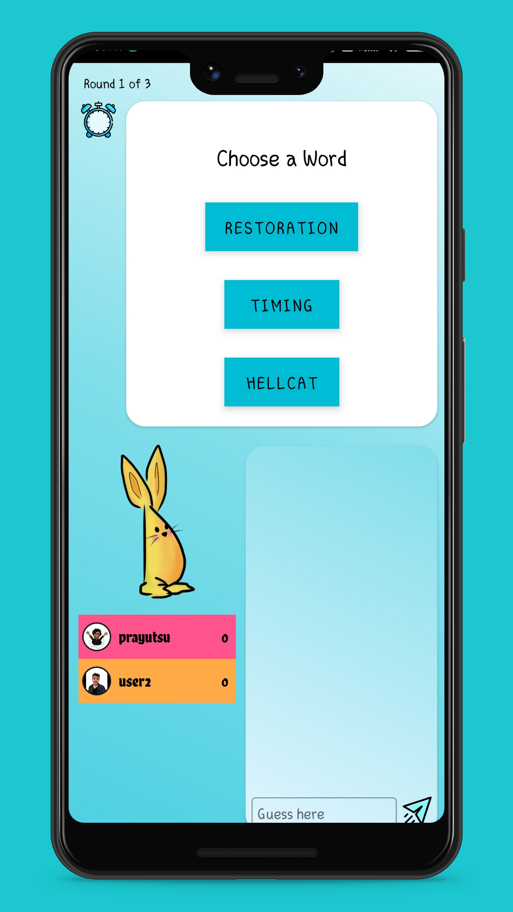
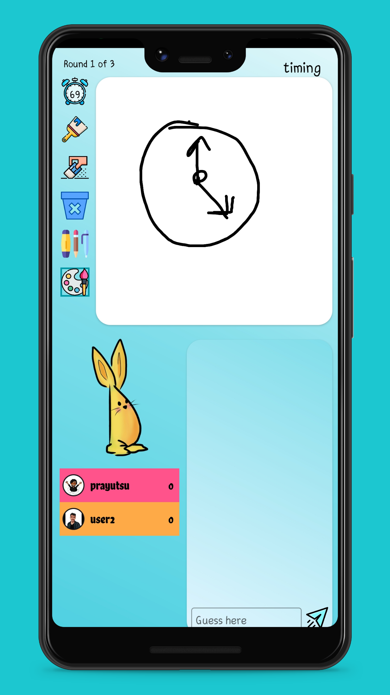
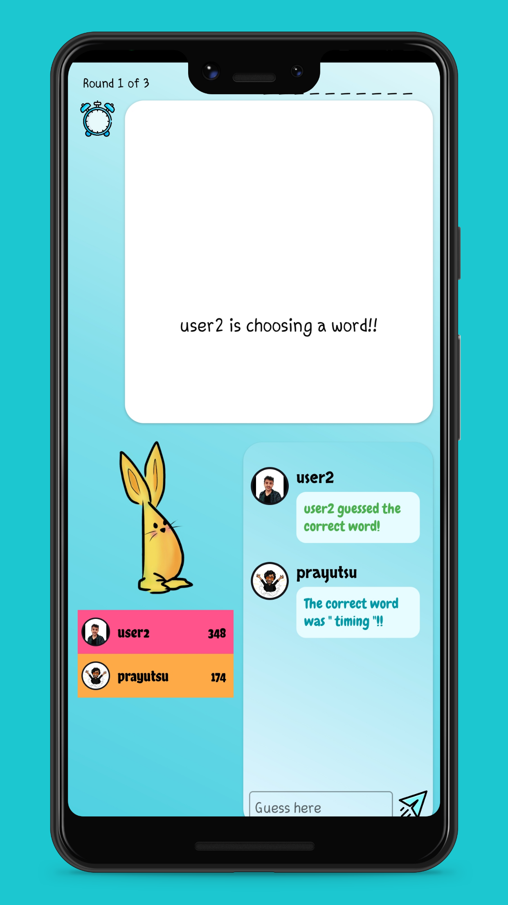
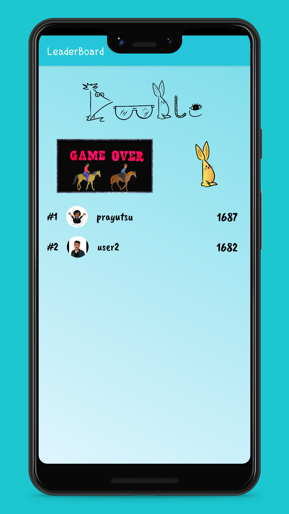

# Do-odle
Multiplayer Pictionary Game 

# HOW TO PLAY?

1 -> Create or login using an existing account.

2 -> Create a room and share the roomcode with your friends and invite them to play.

3 -> After all the players have joined, one who created the room can start the game.

4 -> One by one each player selects a word and try to draw such that other players can guess it right.

5 -> One who gueesses early gets the maximum points.

**Note - Only 2-6 players can be accommodated in a room**

# Download

Click [here](https://drive.google.com/file/d/18lGMkGztZNcHgRU2F1Wxf0Xe0akniW7A/view?usp=sharing) to download the apk.

# Screenshots

 

